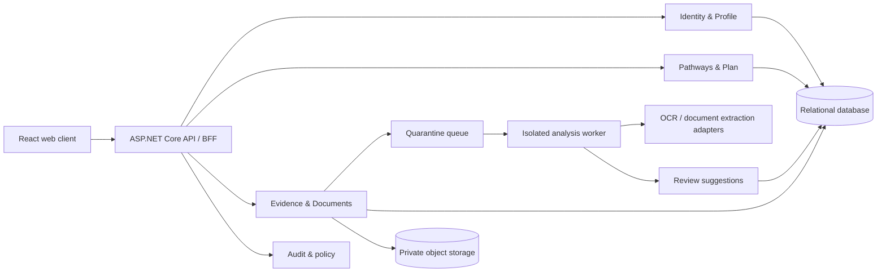

# Architectural breakdown

## Recommended shape

Start with a **modular monolith** in ASP.NET Core 10 rather than distributed microservices. The product is still discovering its domain boundaries; one deployable keeps operations and security review understandable while enforcing internal module boundaries that can be separated later.

## Deployable components

| Component | Responsibility | Initial technology |
| --- | --- | --- |
| Web client | Accessible workflow, local drafts, source review | React + Vite |
| Web/API host | Authentication, authorization, antiforgery, APIs, static client | ASP.NET Core 10 |
| Domain modules | Profiles, evidence, pathways, plans, consent, audit | .NET class libraries/namespaces |
| Analysis worker | Malware-safe orchestration, OCR, classification, field extraction | .NET Worker Service in isolated runtime |
| Relational store | Users, structured evidence, provenance, consent, plan, audit metadata | PostgreSQL or Azure SQL |
| Object store | Encrypted originals and sanitized derivatives | Azure Blob Storage or S3-compatible private storage |
| Queue | Decouple uploads from scanning and extraction | Azure Service Bus or equivalent |
| Observability | Traces, metrics, security events with redaction | OpenTelemetry + approved sink |

## Domain modules

- **Identity and Access:** account, role, session, consent version, device/session revocation.
- **Profile:** manually confirmed service facts and education; never stores unreviewed inference as truth.
- **Evidence:** documents, hashes, retention state, sanitized derivatives, source references.
- **Analysis:** extraction jobs, extractor/model versions, candidates, confidence, validation status.
- **Translation:** evidence-to-competency mappings and explanations.
- **Pathways:** career paths, credentials, federal series, source version and effective dates.
- **Plan:** saved targets, gaps, actions, completion, exports.
- **Audit and Policy:** immutable security/business events, redaction, deletion attestations.

Modules communicate through explicit commands/events and cannot query another module's tables directly. A transactional outbox preserves event delivery without introducing distributed transactions.

## Core records

- `ProfileFact`: value, fact type, status (`confirmed`, `superseded`), confirmedBy, confirmedAt.
- `EvidenceDocument`: owner, SHA-256 hash, media type, size, storage state, classification flag, retention deadline.
- `ExtractionJob`: document, pipeline version, state, timestamps, failure code.
- `CandidateFact`: proposed value, normalized value, confidence, source page/region/snippet hash, extractor version, review decision.
- `PathwaySource`: provider, source URL/document, retrievedAt, effectiveAt, supersededAt.
- `PlanItem`: target, rationale, source versions, user status.
- `AuditEvent`: actor, action, resource, outcome, policy version, correlation ID; no raw document text.

## API style

Use resource-oriented JSON APIs with Problem Details, optimistic concurrency, idempotency keys for writes, and short-lived upload grants. Representative endpoints:

- `POST /api/documents/upload-intents`
- `PUT <private signed upload target>`
- `POST /api/documents/{id}/complete`
- `GET /api/analysis-jobs/{id}`
- `GET /api/reviews/{id}/candidates`
- `POST /api/reviews/{id}/decisions` with an idempotency key
- `GET/PUT /api/profile` with an ETag
- `GET/POST /api/plan/items`

The client never receives storage credentials with broad scope and never calls extraction providers directly.

## Analysis state machine

`Created → Uploading → Quarantined → Scanning → Sanitizing → Extracting → Validating → AwaitingReview → Applied/Rejected → Retained/Deleted`

Any failure moves to a terminal, user-readable error without skipping quarantine. Applying candidates is a separate authenticated command from extraction.

## Evolution path

1. Prototype: current React app + .NET static host; no production document upload.
2. Pilot: modular APIs, synthetic/approved docs, local deterministic parser, manual review.
3. Controlled beta: private storage, queue, malware/CDR, managed OCR, audited review, SSO/MFA.
4. Production: completed data classification, authorization boundary, retention enforcement, incident exercises, model/vendor assessment.

Split the analysis worker into its own service first if load or isolation demands it. Do not split business modules merely to imitate a microservice diagram.

## Architecture decision records to create

- ADR-001 modular monolith and extraction-worker isolation.
- ADR-002 relational database and field-level provenance model.
- ADR-003 object storage, key ownership, and deletion semantics.
- ADR-004 extraction provider and region selection.
- ADR-005 identity provider, MFA, and authorization model.
- ADR-006 CUI/PII determination and system authorization boundary.
- ADR-007 retention defaults and user-controlled deletion.
