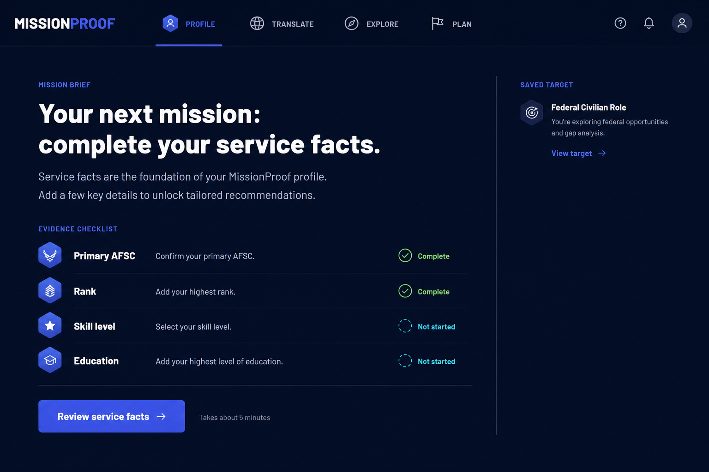
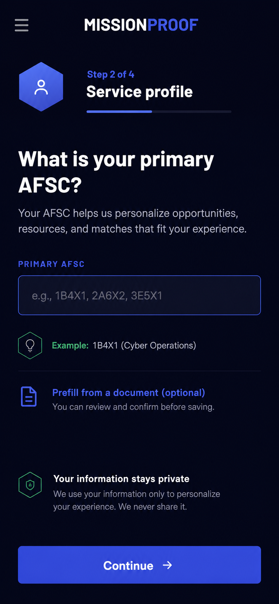
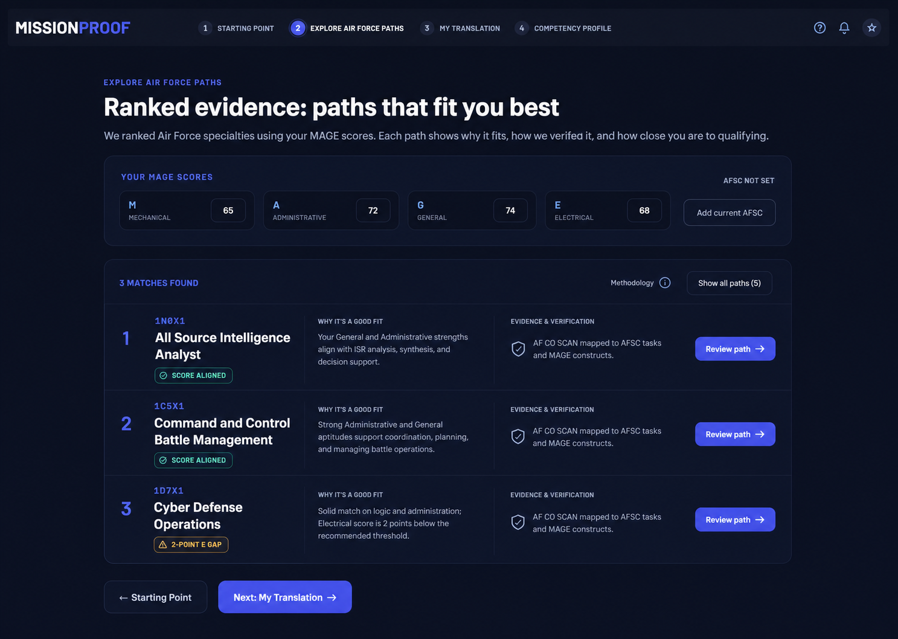
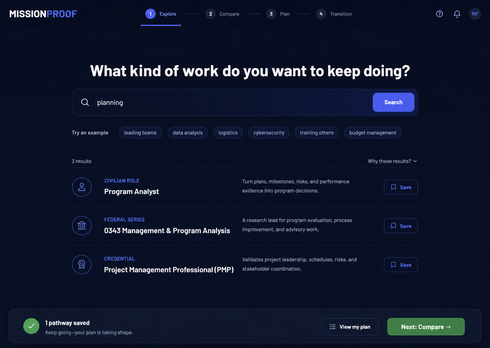
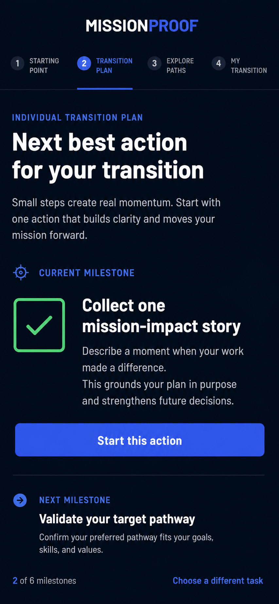
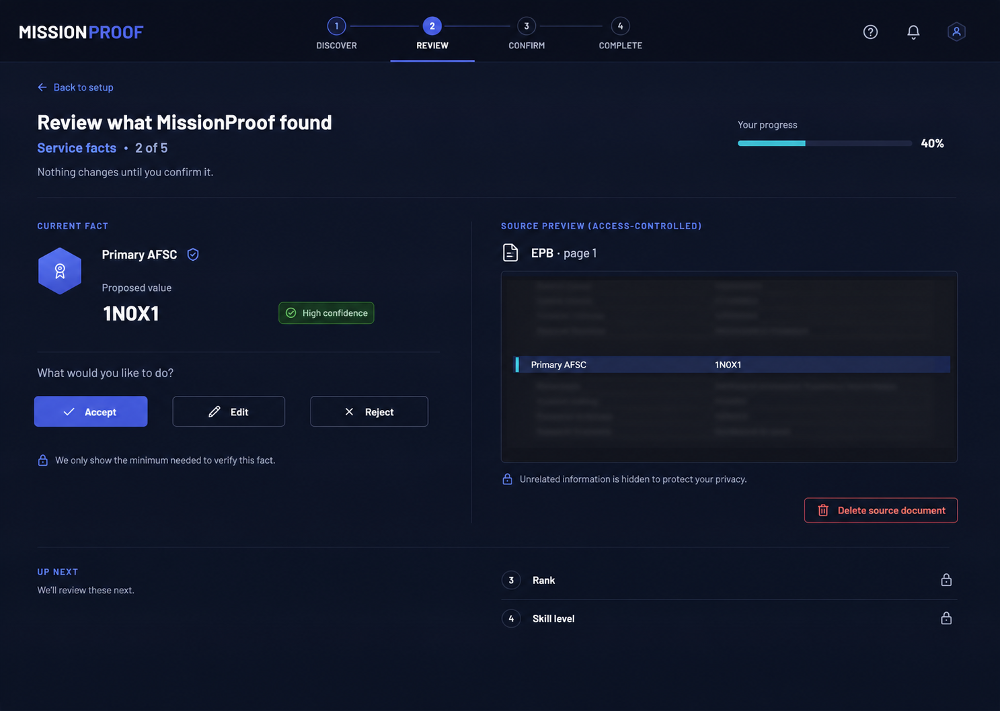

# Six simplicity-focused design directions

These are structural alternatives grounded in the current MissionProof navy/cyan/green identity. They should be judged on comprehension, completion, mobile resilience, and trust—not novelty.

## Mission Brief

A single “briefing” screen answers: where am I, what is known, and what should I do next? A compact left journey rail is available on desktop; the main surface contains one next-best-action module and a simple evidence checklist.

Best for: first and returning sessions. Risk: the dashboard can grow if every team asks for a card. Guardrail: one primary module plus one small supporting list.

## Guided Journey

A step-by-step workspace shows one question at a time, with “Step 2 of 4” and a persistent Continue action. Users can save and exit; the full journey lives in a sheet rather than the page header.

Best for: mobile setup and unfamiliar users. Risk: expert users may feel slowed down. Guardrail: provide “Review all” after the first successful completion.

## Ranked Evidence

Results are a clean ranked list instead of a grid of cards. The first three show alignment, the most important gap, and one action. Methodology and remaining results are collapsed.

Best for: Air Force paths, credentials, civilian/federal matches. Risk: ranking can imply certainty. Guardrail: explain the score and use “research lead,” not “best.”

## Calm Search

Search is the dominant control. After one query, three grouped rows show Civilian, Federal, and Credential interpretations. A sticky plan bar confirms saves without adding more cards.

Best for: users who know the kind of work they enjoy. Risk: blank-search anxiety. Guardrail: offer six plain-language example prompts and a “use my profile” action.

## Next Best Action

The product opens directly to the most useful unfinished action. A short timeline previews only the current and next action; completed work collapses into history. Progress is expressed as meaningful milestones rather than a large percentage.

Best for: engagement and returning users. Risk: recommendation errors can block exploration. Guardrail: “Choose a different task” stays visible.

## Progressive Review

Document-assisted setup centers a side-by-side review queue. One candidate field appears with source evidence, confidence, and Accept/Edit/Reject. Category progress replaces a dense form; original documents remain visually secondary.

Best for: EPB/EPR/OPB/OPR prefill. Risk: one-by-one review can feel slow. Guardrail: group only high-confidence structured facts while keeping each decision reversible.

## Shared visual rules

- Preserve navy header, cyan interaction accent, green confirmation, white/near-white reading surfaces, and hexagonal brand motifs.
- Body type 16px; supporting type ≥14px; calm line lengths.
- Use one elevation level at most; prefer whitespace and dividers.
- No more than one primary button per viewport region.
- Mobile content is not a squeezed desktop grid; reorder it around the task.
- Animations communicate state change in 150–240ms and respect reduced motion.
- Top navigation becomes four journey groups; local substeps auto-fit or move into a scroll-free sheet.

## Decision scorecard

Test each mock with representative first-time and returning users. Score 1–5 for: task understood in five seconds, first useful result time, mobile completion, perceived trust, ability to recover/change direction, accessibility, and implementation complexity. Reject any direction that improves visual calm by hiding provenance, warnings, or user control.
