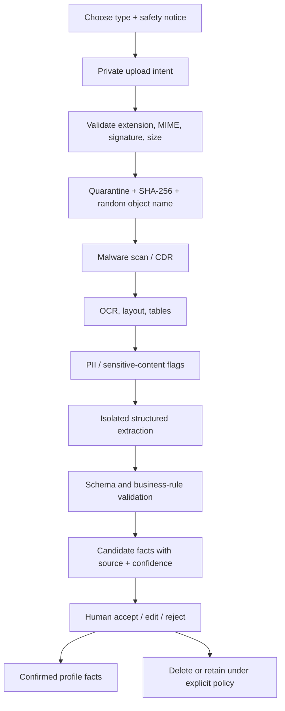

# Secure document ingestion and assisted prefill

## Goal and scope

Reduce repetitive setup by analyzing approved EPB/EPR/OPB/OPR files and supporting documents, then proposing structured facts for human review. The current official evaluation terminology and rules should be verified against the latest Department of the Air Force publication; [AFI 36-2406 (22 August 2025)](https://static.e-publishing.af.mil/production/1/af_a1/publication/afi36-2406/afi36-2406.pdf) is the starting source used for this proposal.

Supported pilot types:

- EPB/EPR/OPB/OPR PDF or image, including legacy records.
- Training report or certificate.
- Award/citation.
- Résumé supplied by the user.
- Unofficial education/credential summary where explicitly permitted.

Do not accept classified material, medical records, passwords, full identity documents, or operationally sensitive attachments. A pre-upload checklist should help users redact SSNs/DoD IDs, signatures, contact details, unit/location details, and anything not needed for career translation.

## Pipeline



The UI should report understandable states (“Security scan,” “Reading layout,” “Preparing suggestions”) and never claim completion until candidates are ready. A failure must not create partial profile facts.

## Candidate schema

```json
{
  "field": "service.primaryAfsc",
  "proposedValue": "1N0X1",
  "normalizedValue": "1N0X1",
  "confidence": 0.94,
  "source": {
    "documentId": "opaque-id",
    "page": 1,
    "region": [0.12, 0.18, 0.42, 0.23],
    "snippetHash": "sha256:..."
  },
  "extractor": { "name": "epb-layout-v1", "version": "1.3.0" },
  "warnings": [],
  "reviewState": "pending"
}
```

Store the source excerpt only where classification and retention allow it. The UI may render a temporary, access-controlled snippet or page crop; audit logs keep IDs/hashes, not raw content.

## Proposed facts

High-confidence, structured candidates: name (optional and usually unnecessary), rank/grade, AFSC, duty title, rating period, education/credential names and dates.

Human-judgment candidates: duties, leadership scope, tools/systems, training delivered, awards, quantified outcomes, competencies, and accomplishment statements. These should be labeled “draft interpretation,” never official facts.

Prohibited inference: clearance eligibility, medical status, disability, protected traits, misconduct, personality, employability, final qualification, or any conclusion not explicitly supported and authorized.

## Review interaction

- Show one candidate group at a time: Service facts, Education, Responsibilities, Outcomes, Competencies.
- Each row contains proposed value, confidence label, “view source,” Accept, Edit, Reject.
- Bulk accept is disabled by default and never available for low-confidence or judgment-based candidates.
- “View source” opens the exact page/region beside the candidate, not a detached document viewer.
- Applying candidates shows a diff and creates new confirmed facts; it does not overwrite history.
- Rejected values improve only tenant-safe evaluation datasets if the user separately opted in and the data is permitted.

## Tool options

| Layer | Option | Best use | Constraint |
| --- | --- | --- | --- |
| DOCX text | Open XML SDK | Deterministic local extraction | No OCR; templates vary |
| Text PDF | PdfPig or equivalent | Local text/position extraction | Scanned PDFs need OCR |
| Local OCR | Tesseract | Offline development and fallback | Lower layout accuracy; language packs/ops burden |
| Managed document AI | [Azure AI Document Intelligence .NET SDK](https://learn.microsoft.com/en-us/dotnet/api/overview/azure/ai.documentintelligence-readme?view=azure-dotnet) | OCR, layout, tables, classification, custom fields | Vendor/region/cost/security assessment required |
| Broader managed analysis | [Azure document AI selection guidance](https://learn.microsoft.com/en-us/azure/ai-services/content-understanding/choosing-right-ai-tool) | Selecting Document Intelligence vs Content Understanding | Do not adopt without a measured pilot |
| Language normalization | Enterprise-hosted language model | Convert confirmed facts to controlled drafts | Must be isolated, schema-bound, cited, and review-only |

Recommended pilot: deterministic parser first, Azure Document Intelligence for OCR/layout second, and a language model only after structured facts are validated. Benchmark against a redacted/synthetic golden set before selecting a provider.

## .NET extension points

```csharp
public interface IDocumentScanner
{
    Task<ScanResult> ScanAsync(QuarantinedDocument document, CancellationToken cancellationToken);
}

public interface IDocumentExtractor
{
    bool Supports(DocumentKind kind, string mediaType);
    Task<ExtractionResult> ExtractAsync(SanitizedDocument document, CancellationToken cancellationToken);
}

public interface ICandidateValidator
{
    ValidationResult Validate(ExtractionResult extraction);
}

public interface IReviewApplicationService
{
    Task ApplyAsync(Guid reviewId, IReadOnlyCollection<CandidateDecision> decisions,
        string idempotencyKey, ClaimsPrincipal actor, CancellationToken cancellationToken);
}
```

Adapters must return typed data, provider request IDs, versions, timing, and safe error codes. They do not receive repositories that can modify profiles.

## Evaluation plan

Build a representative synthetic/redacted corpus by document type, year/template, digital/scanned quality, rotation, handwriting/noise, and missing sections. Measure field precision/recall, source-region accuracy, calibration by confidence band, processing latency, cost, rejection/correction rate, sensitive-content false negatives, and adversarial-instruction resistance.

Pilot exit criteria:

- ≥99% precision for auto-highlighted structured identifiers; still human-reviewed.
- No profile writes without a recorded decision and idempotency key.
- 100% of candidates have document, page, extractor version, and confidence.
- Zero raw-document content in logs and analytics.
- Deletion and retention reconciliation passes.
- Users correct/reject judgment-based candidates without losing their edits or provenance.
